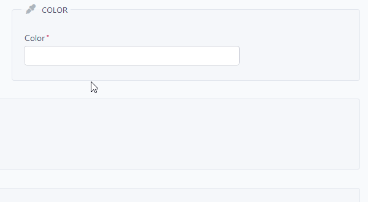
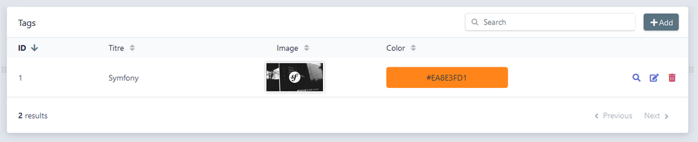
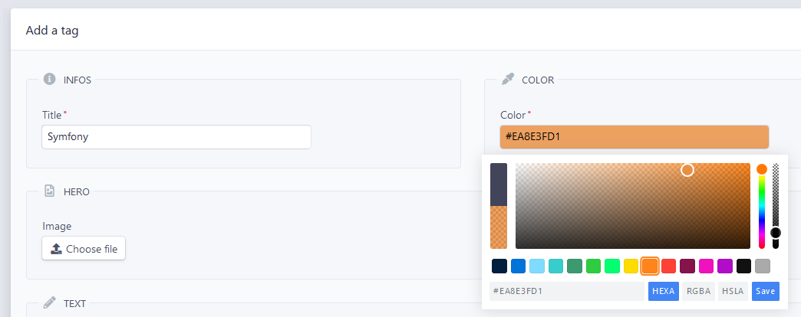

# ColorPickerBundle

### About

ColorPickerPlus is a Symfony 4 wrapper for [Simonwep/pickr](https://github.com/Simonwep/pickr) Javascript Color-Picker library.

<p align="center">
    
</p>

### Features

- Add a custom `FormType` that displays a javascript color picker
- Add a new custom `Constraint` to the validator
- Add some `Twig` filters to convert colors

### Requirements

see [composer.json](https://github.com/WandiParis/ColorPickerBundle/blob/master/composer.json)

### Install

```shell
$ composer require wandi/color-picker-bundle
```

### Install the assets

```shell
php bin/console assets:install public
```

### Entity

We recommand you to store the hexadecimal color code with alpha (`AARRGGBB hex`) because it's the shortest standard with a length of simply 9 chars.

You'll be able later to convert to `HSL`, `HSLA`, `RGB` & `RGBA` if needed (see below).

This bundle is packaged with a custom constraint `HexColor` that validates this format, see `color` property on the following example

```php
namespace App\Entity;

use Doctrine\ORM\Mapping as ORM;
use Symfony\Component\Validator\Constraints as Assert;
use Wandi\ColorPickerBundle\Validator\Constraints as WandiAssert;

/**
 * Tag
 *
 * @ORM\Table(name="tag")
 * @ORM\Entity(repositoryClass="App\Repository\TagRepository")
 */
class Tag
{
    /**
     * @var int
     *
     * @ORM\Column(name="id", type="integer")
     * @ORM\Id
     * @ORM\GeneratedValue(strategy="AUTO")
     */
    private $id;
    
    /**
     * @var string
     *
     * @ORM\Column(name="title", type="string", length=255)
     * @Assert\NotBlank(message="You must fill the title.")
     */
    private $title;
    
    /**
     * @var string
     *
     * @ORM\Column(name="color", type="string", length=9)
     * @WandiAssert\HexColor()
     * @Assert\NotBlank(message="You must choose a color.")
     */
    private $color;
    
    // some getters/setters...
}
```

### FormType

This bundle is packaged with a custom `ColorPickerType` that'll add the Javascript color picker to the input of your choice.

All `Simonwep/pickr` options are overridable, [see complete configuration reference](https://github.com/Simonwep/pickr#user-content-options). 

```php
namespace App\Form\Type;

use Symfony\Component\Form\AbstractType;
use Symfony\Component\Form\Extension\Core\Type\TextType;
use Symfony\Component\Form\FormBuilderInterface;
use Symfony\Component\OptionsResolver\OptionsResolver;
use Wandi\ColorPickerBundle\Form\Type\ColorPickerType;
use Wandi\ColorPickerBundle\PickerOptions\Theme;

/**
 * Class TagType
 */
class TagType extends AbstractType
{
    /**
     * @param FormBuilderInterface $builder
     * @param array                $options
     */
    public function buildForm(FormBuilderInterface $builder, array $options)
    {
        // e.g. we override pickr_options theme
        $options = [
            'pickr_options' => [
                'theme' => Theme::NANO,
                // ...
            ],
        ];
    
        $builder
            ->add('title', TextType::class, ['label' => 'Title'])
            ->add('color', ColorPickerType:class, $options)
            ;
    }

    /**
     * @param OptionsResolver $resolver
     */
    public function configureOptions(OptionsResolver $resolver)
    {
        $resolver->setDefaults(
            array(
                'data_class' => 'App\Entity\Tag',
            )
        );
    }
}
```

### Form Theme

Include our `Form Theme`, it contains the widget that will handle all the Javascript.

```yaml
# config/packages/twig.yaml
twig:
    # ...
    form_themes:
        - '@WandiColorPicker/form/fields.html.twig'
```

### Translations

`Simonwep/pickr` have 3 buttons with litteral text (Clear, Save, Cancel).

If you need to change the translations or add your own locale, simply override `ColorPickerBundle.xx.yaml`

### Twig Filters

If you want to convert your color, use one of the following `Twig filters`:

```twig
<h2>Without Alpha Channel</h2>

Test hex: {{ tag.color|wandi_color_picker_convert(constant("Wandi\\ColorPickerBundle\\Twig\\ExtensionColorExtension::COLOR_HEX")) }}
> {# #FF851B #}
Test rgb: {{ tag.color|wandi_color_picker_convert(constant("Wandi\\ColorPickerBundle\\Twig\\ExtensionColorExtension::COLOR_RGB")) }}
> {# rgb(255, 133, 27) #}
Test hsl: {{ tag.color|wandi_color_picker_convert(constant("Wandi\\ColorPickerBundle\\Twig\\ExtensionColorExtension::COLOR_HSL")) }}
> {# hsl(27.89474, 100%, 55.29412%) #}

<h2>With Alpha Channel</h2>

Test hex: {{ tag.color|wandi_color_picker_convert(constant("Wandi\\ColorPickerBundle\\Twig\\ExtensionColorExtension::COLOR_HEX")) }}
> {# #39855AC4 #}
Test rgb: {{ tag.color|wandi_color_picker_convert(constant("Wandi\\ColorPickerBundle\\Twig\\ExtensionColorExtension::COLOR_RGB")) }}
> {# rgba(57, 133, 90, 0.77) #}
Test hsl: {{ tag.color|wandi_color_picker_convert(constant("Wandi\\ColorPickerBundle\\Twig\\ExtensionColorExtension::COLOR_HSL")) }}
> {# hsla(146.05263, 40%, 37.2549%, 0.77) #}
```

Feel free to use these `helpers` to set dynamically `HTML` inline styles (e.g. `color` or `background-color`).
  
If you need to know the brightness of the color, you can also use the filter:

```twig
{{ tag.color|wandi_color_picker_get_brightness }}
> {# will return Wandi\ColorPickerBundle\Twig\Extension\ColorExtension::BRIGHTNESS_LIGHT or Wandi\ColorPickerBundle\Twig\Extension\ColorExtension::BRIGHTNESS_DARK depending on the color value #}
```

If you apply a dynamic background-color to an HTML element, it can be usefull to also change the text color.

### WandiEasyAdminPlusBundle

If you're using [EasyAdminPlusBundle](https://github.com/WandiParis/EasyAdminPlusBundle/tree/master), our wrapper of [EasyAdminBundle](https://github.com/EasyCorp/EasyAdminBundle/tree/master), you can easily use this bundle is the admin area.

#### List/Show

```yaml
- { property: color, label: 'Color', template: '@WandiEasyAdminPlus/templates/wandi_color_picker.html.twig' }
```

<p align="center">
    
</p>

#### New/Edit

```yaml
- { property: color, label: 'Color', type: 'Wandi\ColorPickerBundle\Form\Type\ColorPickerType' }
```

<p align="center">
    
</p>